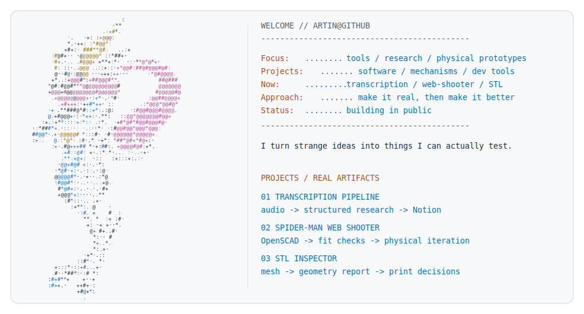

<a href="https://github.com/Lordphoenix1223/Lordphoenix1223">
  <picture>
    <source media="(prefers-color-scheme: dark)" srcset="./dark_mode.svg">
    <source media="(prefers-color-scheme: light)" srcset="./light_mode.svg">
    
  </picture>
</a>

## What I'm building

01. [Arkire](https://arkirehq.com) — Internal software for turning company activity into usable content. [Visit →](https://arkirehq.com)

02. [Interview transcription pipeline](https://github.com/Lordphoenix1223/transcription-organizer-pipeline) — Recordings become structured transcripts and Notion rows. [View repo →](https://github.com/Lordphoenix1223/transcription-organizer-pipeline)

03. [Mechanical prototyping](https://github.com/Lordphoenix1223/openscad-mechanical-prototyping) — OpenSCAD mechanism studies with fit checks, renders, and physical iteration. [View repo →](https://github.com/Lordphoenix1223/openscad-mechanical-prototyping)

04. [STL Inspector CLI](https://github.com/Lordphoenix1223/stl-inspector-cli) — Fast geometry reports for checking exported models before printing. [View repo →](https://github.com/Lordphoenix1223/stl-inspector-cli)

## Start here

```bash
git clone https://github.com/Lordphoenix1223/stl-inspector-cli
cd stl-inspector-cli
python -m pip install -e .
stl-inspector path/to/model.stl
```

## Next

- Publish a small, redacted Arkire workflow demo.
- Add deterministic sample fixtures to the transcription pipeline.
- Document fit and test results for the current mechanical prototype.
