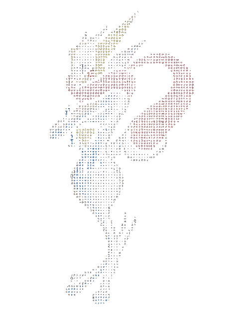

<table>
  <tr>
    <td width="46%" align="center" valign="middle">
      
    </td>
    <td valign="top">
      <pre>artin@github
------------------------------------------------
Focus: ............. software, research, physical systems
Method: ............ prototypes, tests, documentation
Current work: ..... transcription pipelines, CAD, STL tooling
Projects: ......... 3 real repositories
Status: ........... building in public
------------------------------------------------
I build tools for turning messy ideas into working artifacts.</pre>
    </td>
  </tr>
</table>

## Projects

- [transcription-organizer-pipeline](https://github.com/Lordphoenix1223/transcription-organizer-pipeline) — recordings → structured research
- [openscad-mechanical-prototyping](https://github.com/Lordphoenix1223/openscad-mechanical-prototyping) — CAD → fit testing → physical iteration
- [stl-inspector-cli](https://github.com/Lordphoenix1223/stl-inspector-cli) — mesh → geometry report → faster decisions

I build tools for turning messy ideas into working artifacts across software, research, and physical systems.
